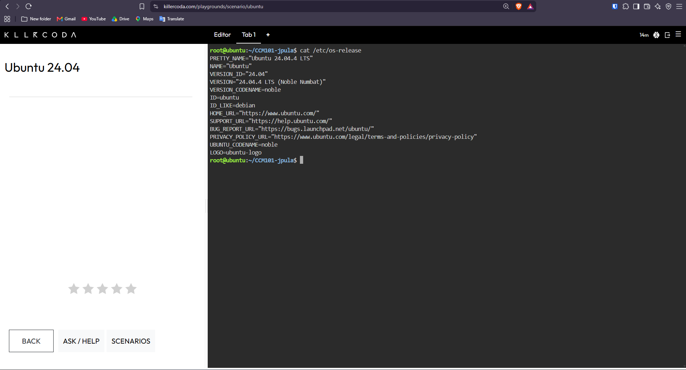
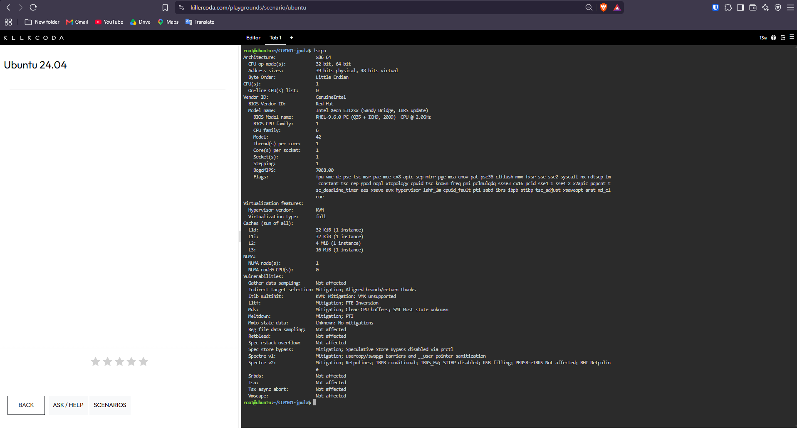
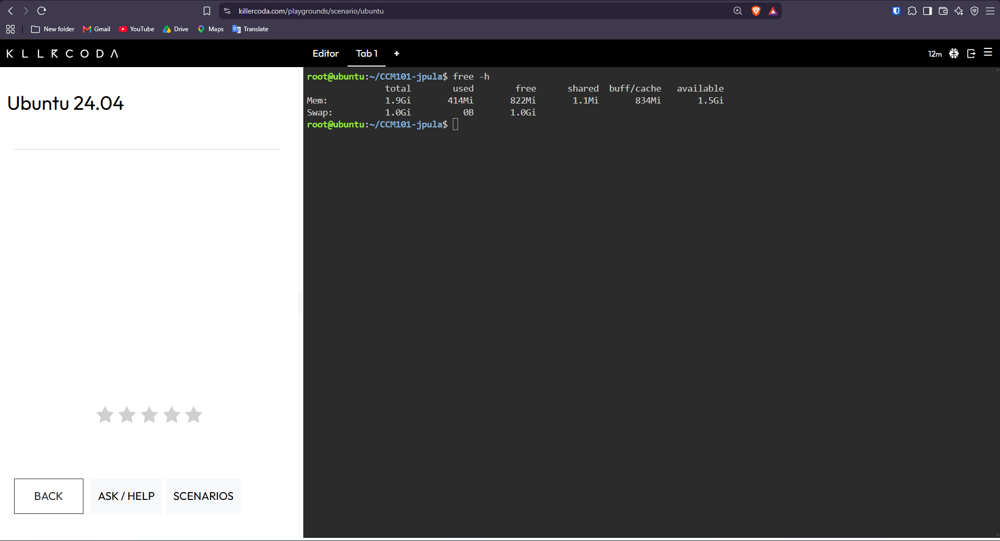
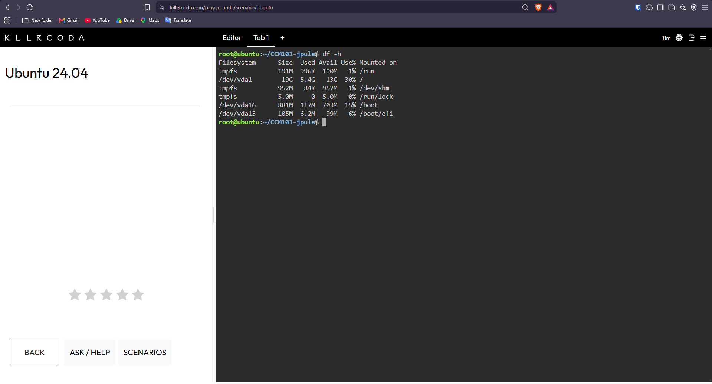

# ☁️ Linux Server Investigation and Cloud Migration

This document presents an investigation of a Linux server using the KillerCoda Playground. The investigation focuses on gathering basic server information, exploring cloud migration options, and comparing virtual machine services offered by AWS, Microsoft Azure, and Google Cloud Platform.

---

# 1. Linux Server Investigation

Several Linux commands were executed in the KillerCoda Playground to collect important information about the Linux server.

| **Information**      | **Linux Command**     | **Command Description**                                                                                                    |
| -------------------- | --------------------- | -------------------------------------------------------------------------------------------------------------------------- |
| **Operating System** | `cat /etc/os-release` | Shows details about the installed Linux operating system, including its name, version, and distribution.                   |
| **CPU Information**  | `lscpu`               | Provides information about the CPU, including its architecture, processors, cores, and threads.                            |
| **Memory**           | `free -h`             | Shows the amount of total, used, free, and available RAM. The `-h` option displays the values in an easier-to-read format. |
| **Disk Space**       | `df -h`               | Displays information about the available and used storage space on the server's file systems.                              |

---

# 2. Commands and Results

## Operating System

### Command

```
cat /etc/os-release
```

### Description

The `cat /etc/os-release` command is used to view information about the Linux operating system installed on the server. The output normally includes details such as the operating system name, version, ID, and distribution information.

### Result



---

## CPU Information

### Command

```
lscpu
```

### Description

The `lscpu` command provides detailed information about the server's processor. It can display the CPU architecture, number of processors, cores, threads, and other hardware-related details.

### Result



---

## Memory

### Command

```
free -h
```

### Description

The `free -h` command is used to check the server's memory usage. It provides information about the total, used, free, shared, and available RAM.

The `-h` option stands for **human-readable**, which allows the memory values to be displayed in easier-to-read units such as MB or GB.

### Result



---

## Disk Space

### Command

```
df -h
```

### Description

The `df -h` command is used to check the server's disk storage. It displays the total storage capacity, used space, available space, and the percentage of storage currently being used.

The `-h` option makes the storage information easier to read by displaying the values in human-readable units.

### Result



---

# 3. Cloud Migration

If the Linux server were moved to a cloud environment, it could be deployed using virtual machine services from AWS, Microsoft Azure, or Google Cloud Platform.

| **Cloud Platform**        | **Cloud Service**      | **Purpose**                                                             |
| ------------------------- | ---------------------- | ----------------------------------------------------------------------- |
| **AWS**                   | Amazon EC2             | Provides Linux virtual machines through AWS cloud infrastructure.       |
| **Microsoft Azure**       | Azure Virtual Machines | Provides Linux virtual machines through Microsoft Azure infrastructure. |
| **Google Cloud Platform** | Google Compute Engine  | Provides Linux virtual machines through Google Cloud infrastructure.    |

Cloud virtual machine services allow organizations to operate Linux servers without having to purchase and maintain physical server hardware. They also provide flexible resources that can be increased or decreased depending on the workload.

---

# 4. Cloud Services

## AWS – Amazon EC2

**Amazon EC2 (Elastic Compute Cloud)** allows a Linux server to be hosted as a virtual machine within AWS. Users can choose different computing resources, including CPU, memory, storage, and networking, based on the requirements of the server.

EC2 also provides scalable computing resources, making it suitable for hosting Linux applications, websites, and other server-based services.

---

## Microsoft Azure – Azure Virtual Machines

**Azure Virtual Machines** allows Linux servers to operate using Microsoft's cloud infrastructure. It supports various Linux distributions and provides options for configuring CPU, memory, storage, networking, and other resources.

This service can be used to move existing Linux applications and workloads into the Microsoft Azure cloud environment.

---

## Google Cloud – Google Compute Engine

**Google Compute Engine** provides virtual machines that can be used to host Linux servers within Google Cloud. Users can configure resources such as CPU, memory, storage, and networking according to the needs of their workloads.

Compute Engine is suitable for running Linux applications, websites, and other server-based workloads in a cloud environment.

---

# 5. Cloud Platform Comparison

AWS, Microsoft Azure, and Google Cloud Platform all provide similar virtual machine services that can be used to host Linux servers.

| **Requirement**           | **AWS**      | **Microsoft Azure**    | **Google Cloud**      |
| ------------------------- | ------------ | ---------------------- | --------------------- |
| **Linux Virtual Machine** | Amazon EC2   | Azure Virtual Machines | Google Compute Engine |
| **CPU Resources**         | Configurable | Configurable           | Configurable          |
| **Memory**                | Configurable | Configurable           | Configurable          |
| **Storage**               | Amazon EBS   | Azure Managed Disks    | Persistent Disk       |
| **Scalability**           | Yes          | Yes                    | Yes                   |

### Comparison Summary

All three cloud providers support Linux workloads and allow users to configure computing resources based on their requirements.

* **AWS** provides **Amazon EC2** for virtual machines and **Amazon EBS** for block storage.
* **Microsoft Azure** provides **Azure Virtual Machines** along with **Azure Managed Disks**.
* **Google Cloud** provides **Google Compute Engine** and **Persistent Disk**.

Choosing the most suitable cloud platform depends on several factors, including the organization's existing infrastructure, required services, budget, scalability requirements, and overall cloud strategy.

---

# 6. Conclusion

The Linux server investigated in the KillerCoda Playground can be migrated to any of the three major cloud platforms.

**AWS** provides **Amazon EC2**, **Microsoft Azure** provides **Azure Virtual Machines**, and **Google Cloud Platform** provides **Google Compute Engine** as their main virtual machine services.

These services make it possible to run Linux servers in the cloud while providing configurable CPU, memory, storage, networking, and scaling capabilities.

The investigation shows that a Linux server running in a local or learning environment can be moved to a cloud infrastructure using virtual machine services. This provides organizations with a flexible alternative to managing physical server hardware.

---

# 7. Terminal Screenshots

The screenshots below show the commands and results obtained during the Linux server investigation in the KillerCoda Playground.

## Operating System

The `cat /etc/os-release` command was executed to determine the Linux distribution and operating system version running on the server.


---

## CPU Information

The `lscpu` command was used to examine the server's processor configuration, including its architecture, CPUs, cores, and threads.


---

## Memory

The `free -h` command was used to view the server's memory usage, including the total, used, free, and available RAM.


---

## Disk Space

The `df -h` command was used to check the server's storage capacity and determine how much disk space was currently available and being used.


---

# 📌 Final Summary

This investigation demonstrated how basic information about a Linux server can be collected using standard Linux commands. The commands `cat /etc/os-release`, `lscpu`, `free -h`, and `df -h` were used to examine the operating system, CPU, memory, and disk storage of the server.

The investigation also explored how the Linux server could be migrated to major cloud platforms such as **AWS, Microsoft Azure, and Google Cloud Platform**. Each provider offers virtual machine services that can support Linux workloads, including **Amazon EC2, Azure Virtual Machines, and Google Compute Engine**.

These cloud services provide flexible and scalable computing resources that can be adjusted according to the needs of an organization. When selecting a cloud platform, factors such as technical requirements, existing infrastructure, budget, scalability, and long-term business goals should be considered.
