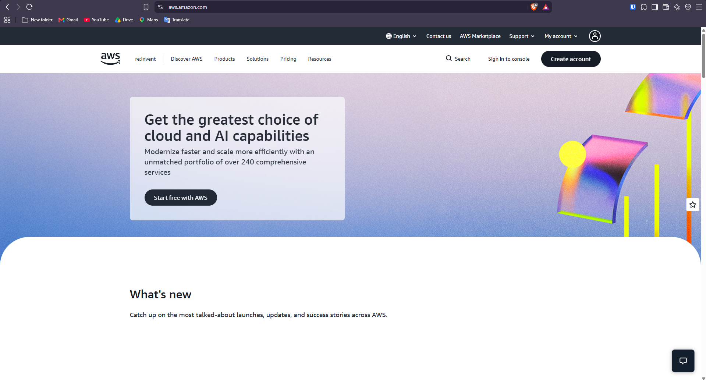

# ☁️ AWS Research

Amazon Web Services (AWS) is a major cloud computing provider that offers many services for computing, storage, databases, networking, security, analytics, and software development. It allows organizations to use cloud resources when needed without having to build and maintain a large amount of physical hardware and infrastructure (Amazon Web Services [AWS], n.d.).

---

## 🌎 1. Brief Overview

AWS gives organizations access to flexible and scalable cloud resources for developing, deploying, and managing applications and other services. Instead of depending only on physical servers and data centers, organizations can use AWS resources based on their workload and business needs.

### Key Areas of AWS

| Area | Description |
| -------------------------- | -------------------------------------------------------- |
| 💻 Computing | Provides virtual machines and other computing resources |
| 💾 Storage | Used for saving files, backups, applications, and datasets |
| 🗄️ Databases | Offers managed database solutions |
| 🌐 Networking | Allows cloud resources and services to communicate with each other |
| 🔐 Security | Provides tools for managing access, identities, and security |
| 📊 Analytics | Helps process and analyze data |
| 🤖 Application Development | Provides tools and services for developing and deploying applications |

---

## 🌍 2. Global Infrastructure

AWS has a global infrastructure that is divided into different **Regions** and **Availability Zones (AZs)**.

- **Regions** – Separate geographic locations around the world where AWS provides its cloud services.
- **Availability Zones (AZs)** – Separate and isolated locations inside an AWS Region that help improve system availability and reliability.
- **Local Zones** – AWS infrastructure located closer to users to support applications that need low network latency.
- **Wavelength Zones** – Infrastructure designed for applications that require extremely low latency through telecommunications networks.
- **AWS Outposts** – Allows AWS services and infrastructure to be used within an organization's own on-premises environment.

Using multiple Availability Zones can help organizations create systems that continue operating even if one location encounters a problem (AWS, 2026a, 2026b).

---

## 🖥️ 3. AWS Management Console

The **AWS Management Console** is a web-based platform that allows users to access and control AWS services. It provides a central interface where users can configure resources, manage services, and monitor their AWS environment.

### Main Functions

- Create and manage cloud resources
- Configure AWS services
- Monitor resources and service status
- Manage users, roles, and permissions
- Check billing and resource usage
- Choose and manage AWS Regions
- Access different AWS services

The management console provides a graphical way to work with AWS, making it possible to manage services without depending completely on command-line tools (AWS, 2026c).

---

## ☁️ 4. Four Core AWS Services

### 💻 4.1 Amazon EC2

**Amazon Elastic Compute Cloud (EC2)** provides virtual servers that can be adjusted according to an organization's needs. EC2 instances can be used to host websites, applications, business systems, and other workloads.

**Primary purpose:** Providing virtual servers and computing resources.

---

### 💾 4.2 Amazon S3

**Amazon Simple Storage Service (S3)** is a cloud object storage service used to save and retrieve different kinds of data. It can support websites, applications, backups, archives, data lakes, and other business data.

**Primary purpose:** Storing data and files in the cloud.

---

### 🗄️ 4.3 Amazon RDS

**Amazon Relational Database Service (RDS)** is a managed service for relational databases. It helps organizations set up, operate, and scale databases without having to manage all of the database infrastructure themselves.

**Primary purpose:** Managing relational databases in the cloud.

---

### ⚡ 4.4 AWS Lambda

**AWS Lambda** is a serverless service that allows users to execute code without directly managing servers. AWS takes care of the underlying infrastructure and automatically adjusts resources based on the workload.

**Primary purpose:** Running applications and code without managing servers.

---

## 🚀 5. Three Major Advantages of AWS

### 1. 📈 Scalability

AWS allows organizations to adjust their cloud resources depending on their workload. Resources can be increased when demand is high and reduced when they are no longer needed.

### 2. 🌎 Global Reach

AWS has infrastructure located across many geographic Regions and Availability Zones. This allows organizations to deploy applications closer to their users and build systems with better availability.

### 3. 🧩 Wide Range of Services

AWS offers a large selection of services for computing, storage, databases, networking, security, analytics, artificial intelligence, and application development.

---

## 🏢 6. Typical Enterprise Use Cases

AWS can support many different business and technology needs for organizations.

### Common Applications

- 🌐 **Website and Web Application Hosting**  
  Used to host company websites, online platforms, and web applications.

- 💾 **Data Storage and Backup**  
  Used to store business files, backups, archives, and large amounts of data.

- 🗄️ **Database Management**  
  Used to operate relational databases needed by business applications.

- ⚡ **Serverless Applications**  
  Used to create applications that can run without directly managing physical or virtual servers.

- 🛡️ **Disaster Recovery**  
  Used to create backup systems and recovery environments for important business applications.

- 📊 **Data Analytics**  
  Used to process and examine large amounts of organizational data.

- 🤖 **Machine Learning and AI**  
  Used to develop and run artificial intelligence and machine learning applications.

- 🔄 **Application Modernization**  
  Used to move older applications and traditional infrastructure into newer cloud-based environments.

---

## 📸 7. AWS Management Console Screenshot

The screenshot below shows the AWS Management Console that was accessed during the laboratory activity.

---

## 📚 References

Amazon Web Services. (n.d.). *Amazon EC2*. Retrieved September 10, 2026, from [https://aws.amazon.com/ec2/](https://aws.amazon.com/ec2/)

Amazon Web Services. (n.d.). *Amazon RDS*. Retrieved September 10, 2026, from [https://aws.amazon.com/rds/](https://aws.amazon.com/rds/)

Amazon Web Services. (n.d.). *AWS Lambda*. Retrieved September 10, 2026, from [https://aws.amazon.com/lambda/](https://aws.amazon.com/lambda/)

Amazon Web Services. (n.d.). *Amazon S3*. Retrieved September 10, 2026, from [https://aws.amazon.com/s3/](https://aws.amazon.com/s3/)

Amazon Web Services. (2026a). *AWS availability zones*. Retrieved September 10, 2026, from [https://docs.aws.amazon.com/global-infrastructure/latest/regions/aws-availability-zones.html](https://docs.aws.amazon.com/global-infrastructure/latest/regions/aws-availability-zones.html)

Amazon Web Services. (2026b). *AWS regions*. Retrieved September 10, 2026, from [https://docs.aws.amazon.com/global-infrastructure/latest/regions/aws-regions.html](https://docs.aws.amazon.com/global-infrastructure/latest/regions/aws-regions.html)

Amazon Web Services. (2026c). *What is the AWS Management Console?* Retrieved September 10, 2026, from [https://docs.aws.amazon.com/awsconsolehelpdocs/latest/gsg/what-is.html](https://docs.aws.amazon.com/awsconsolehelpdocs/latest/gsg/what-is.html)
