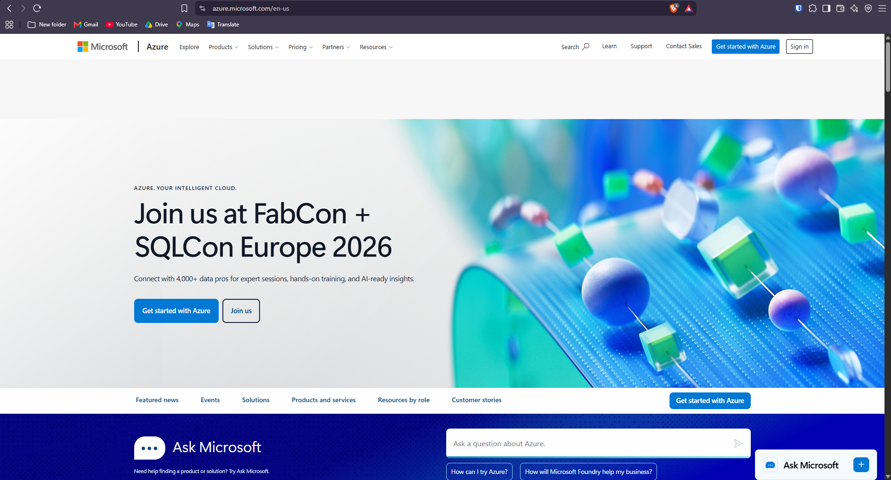

# 🔷 Microsoft Azure Research

Microsoft Azure is a major cloud computing platform developed by Microsoft. It provides various cloud services that can be used by businesses, organizations, developers, and other users.

---

## 📌 1. Brief Overview

Microsoft Azure is Microsoft's cloud platform that offers services for computing, storage, databases, networking, analytics, artificial intelligence, containers, security, and application development.

With Azure, organizations can develop, deploy, and manage applications and IT systems through the cloud without needing to own and maintain all of the required physical hardware. Azure can support both small-scale applications and large enterprise environments (Microsoft, n.d.).

---

## 🌍 2. Global Infrastructure

Microsoft Azure uses a worldwide infrastructure made up of **regions, datacenters, and Availability Zones**.

An Azure **Region** refers to a geographic area where one or more Azure datacenters are located. These regions are grouped into **geographies**, which help organizations meet requirements involving data location, compliance, availability, and network performance.

Azure also has **Availability Zones**, which are separate physical locations within an Azure region. They have independent power, cooling, and networking systems. Deploying applications across multiple Availability Zones can improve reliability and help reduce service interruptions (Microsoft, 2026a, 2026b, 2026c).

> **Key Infrastructure Components**
>
> - 🌎 Azure Regions
> - 🏢 Datacenters
> - 🔄 Availability Zones
> - 🗺️ Azure Geographies
> - ⚡ Low-latency networking

---

## 🖥️ 3. Cloud Management Console

The **Azure portal** is Microsoft's web-based platform for managing Azure resources and services.

Users can use the portal to create, configure, monitor, and manage resources such as virtual machines, databases, applications, storage accounts, and subscriptions. It also includes dashboards, search functions, monitoring tools, and cost-management features (Microsoft, 2026d).

The Azure portal provides a graphical interface that makes managing cloud resources more convenient for users.

---

## ☁️ 4. Four Core Azure Services

### 4.1 Azure Virtual Machines

**Azure Virtual Machines (VMs)** provide virtual computing resources that can be scaled depending on the needs of an organization.

Users can create Windows or Linux virtual machines for different purposes, such as hosting websites, running applications, managing databases, testing software, and performing high-performance computing tasks (Microsoft, n.d.-a).

**Common Uses:**

- Web servers
- Application servers
- Database workloads
- Development and testing
- High-performance computing

---

### 4.2 Azure Blob Storage

**Azure Blob Storage** is an object storage service from Microsoft that is designed for storing large amounts of unstructured information.

It can be used to store documents, pictures, videos, backups, logs, and application-related data (Microsoft, n.d.-b).

**Common Uses:**

- 📁 File and document storage
- 🖼️ Image and video storage
- 💾 Backup and archival
- 📊 Large datasets
- 🌐 Application data

---

### 4.3 Azure SQL Database

**Azure SQL Database** is a managed relational database service that uses Microsoft's SQL Server database technology.

Microsoft handles many administrative tasks, including infrastructure maintenance, updates, backups, monitoring, and availability. This allows organizations to spend more time working with their applications and data instead of maintaining the database infrastructure (Microsoft, n.d.-c).

**Common Uses:**

- Business applications
- Web applications
- Transaction processing
- Data management
- Enterprise databases

---

### 4.4 Azure Functions

**Azure Functions** is a serverless service that allows developers to run code when specific events occur without having to manage servers directly.

It can be used to create APIs, automate processes, handle background tasks, perform scheduled operations, and develop event-based applications (Microsoft, n.d.-d).

**Common Uses:**

- ⚙️ Automation
- 🔗 APIs
- 📩 Event processing
- ⏱️ Scheduled tasks
- 🔄 Background operations

---

## ⭐ 5. Three Major Advantages

### 1. Strong Enterprise Integration

Azure works closely with Microsoft's enterprise products and technologies. This makes it a useful choice for organizations already using technologies such as Windows Server, Microsoft SQL Server, and other Microsoft solutions.

### 2. Global Infrastructure

Azure has regions and datacenters located around the world. Organizations can use these locations to deploy applications closer to their users, which can improve availability and performance while also helping meet data residency requirements.

### 3. Managed Cloud Services

Azure offers many managed services, including Azure SQL Database and Azure Functions. These services reduce the amount of infrastructure management that organizations and development teams need to perform themselves.

---

## 🏢 6. Typical Enterprise Use Cases

Microsoft Azure can support many different types of enterprise workloads, such as:

- 🌐 Hosting Windows and Linux web applications
- ☁️ Moving existing IT systems to the cloud
- 🗄️ Managing relational and enterprise databases
- 🔗 Building APIs and serverless applications
- 📦 Running container-based applications
- 📊 Performing data analytics and business intelligence
- 🤖 Developing artificial intelligence and machine learning solutions
- 💾 Creating backup and disaster recovery systems
- 🔄 Supporting hybrid cloud environments
- 🏢 Integrating Microsoft enterprise applications

---

## 📸 Azure Management Console

*Figure 1. Azure Management Console*

The screenshot above shows the Azure management environment that was explored during the laboratory activity.

---

# 📚 References

Microsoft. (n.d.). *Azure Blob Storage*. Retrieved September 10, 2026, from\
[https://azure.microsoft.com/en-us/products/storage/blobs/](https://azure.microsoft.com/en-us/products/storage/blobs/)

Microsoft. (n.d.). *Azure Functions*. Retrieved September 10, 2026, from\
[https://azure.microsoft.com/en-us/products/functions/](https://azure.microsoft.com/en-us/products/functions/)

Microsoft. (n.d.). *Azure SQL Database*. Retrieved September 10, 2026, from\
[https://azure.microsoft.com/en-us/products/azure-sql/database](https://azure.microsoft.com/en-us/products/azure-sql/database)

Microsoft. (n.d.). *Azure Virtual Machines*. Retrieved September 10, 2026, from\
[https://azure.microsoft.com/en-us/products/virtual-machines](https://azure.microsoft.com/en-us/products/virtual-machines)

Microsoft. (2026a). *Azure global infrastructure*. Retrieved September 10, 2026, from\
[https://azure.microsoft.com/en-us/explore/global-infrastructure](https://azure.microsoft.com/en-us/explore/global-infrastructure)

Microsoft. (2026b). *Azure geographies*. Retrieved September 10, 2026, from\
[https://azure.microsoft.com/en-us/explore/global-infrastructure/geographies](https://azure.microsoft.com/en-us/explore/global-infrastructure/geographies)

Microsoft. (2026c). *Azure availability zones*. Retrieved September 10, 2026, from\
[https://azure.microsoft.com/en-us/explore/global-infrastructure/availability-zones/](https://azure.microsoft.com/en-us/explore/global-infrastructure/availability-zones/)

Microsoft. (2026d). *What is the Azure portal?* Microsoft Learn. Retrieved September 10, 2026, from\
[https://learn.microsoft.com/en-us/azure/azure-portal/azure-portal-overview](https://learn.microsoft.com/en-us/azure/azure-portal/azure-portal-overview)
