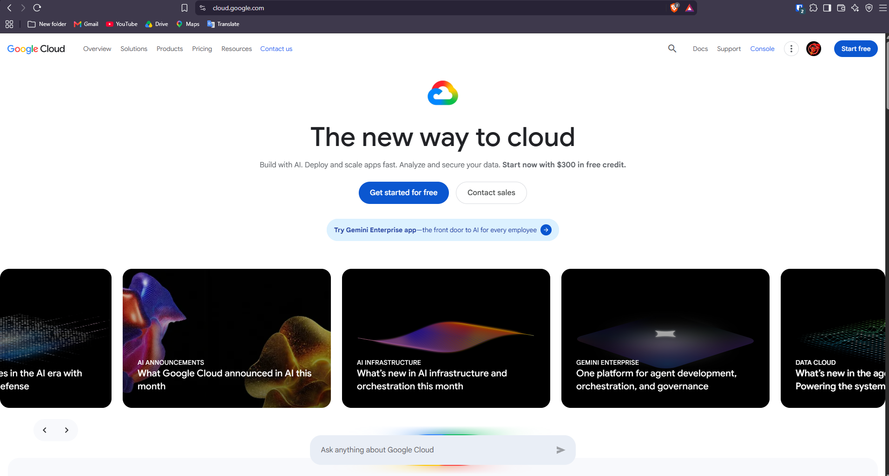

# 🌐 Google Cloud Platform (GCP) Research

Google Cloud Platform (GCP), also called **Google Cloud**, is a major cloud computing provider that offers scalable cloud services for businesses, organizations, developers, and other users.

---

## 📌 1. Brief Overview

Google Cloud is Google's cloud computing platform that provides services for computing, storage, databases, networking, data analytics, containers, application development, and artificial intelligence.

It allows organizations to develop, deploy, and manage applications using Google's worldwide cloud infrastructure. Businesses can also store, process, and analyze data without needing to operate and maintain all of their own physical servers (Google Cloud, n.d.).

---

## 🌍 2. Global Infrastructure

Google Cloud's infrastructure is mainly organized into **Regions and Zones**.

A **Region** is a geographic area where Google Cloud services and infrastructure are available. A **Zone** is an independent location within a region where cloud resources can be deployed. Using resources across multiple zones can help improve application reliability and availability.

Google Cloud also offers **global, regional, and multi-region resources**. These options allow organizations to choose where their applications and services should operate based on their performance, availability, and geographic requirements.

Google's worldwide network also provides high-speed connectivity, helping applications and services communicate efficiently with users in different parts of the world (Google Cloud, 2026a, 2026b).

> **Key Infrastructure Components**
>
> - 🌎 Cloud Regions
> - 🏢 Cloud Zones
> - 🌐 Global Resources
> - 🔄 Multi-Region Resources
> - ⚡ Global Network Infrastructure

---

## 🖥️ 3. Cloud Management Console

The **Google Cloud Console** is a web-based interface that allows users to manage their Google Cloud resources and services.

Through the console, users can manage projects, virtual machines, storage, databases, billing, and other cloud services. It also provides tools such as **Cloud Shell**, which gives users access to a command-line environment for performing cloud management tasks.

Aside from the web console, Google Cloud resources can also be managed using the **Google Cloud CLI** and **REST APIs** (Google Cloud, 2026c).

---

## ☁️ 4. Four Core GCP Services

### 4.1 Compute Engine

**Compute Engine** is Google Cloud's Infrastructure-as-a-Service (IaaS) service that provides virtual machines and computing resources using Google's infrastructure.

Users can create and customize virtual machines to run different workloads without needing to purchase or maintain physical servers.

**Common Uses:**

- 🌐 Web servers
- 💼 Business applications
- 🗄️ Database workloads
- 🧪 Development and testing environments
- ⚙️ Custom computing workloads

---

### 4.2 Cloud Storage

**Cloud Storage** is Google Cloud's object storage service that allows users to store unstructured data in cloud storage buckets.

It can be used to store many types of information, such as files, backups, media, application data, and large datasets (Google Cloud, n.d.-b).

**Common Uses:**

- 📁 File storage
- 💾 Backup and archival
- 🖼️ Image and media storage
- 📊 Analytics datasets
- 🌐 Content distribution

---

### 4.3 Cloud SQL

**Cloud SQL** is a managed relational database service that supports database systems such as **MySQL, PostgreSQL, and SQL Server**.

Google Cloud handles many database management tasks, including backups, replication, updates, encryption, and storage management. This allows organizations to focus more on their applications and data instead of maintaining the database infrastructure themselves (Google Cloud, n.d.-c).

**Common Uses:**

- 🗄️ Business databases
- 🌐 Web application databases
- 📱 Mobile application backends
- 💼 Enterprise systems
- 📊 Structured data management

---

### 4.4 BigQuery

**BigQuery** is a fully managed, serverless data warehouse designed for analyzing large amounts of information.

It supports large-scale data analysis and can be used for analytics, machine learning, and business intelligence. Because it is serverless, users can analyze data without directly managing the infrastructure used to process it (Google Cloud, n.d.-d).

**Common Uses:**

- 📊 Large-scale data analytics
- 📈 Business intelligence
- 🔍 Data exploration
- 🤖 Machine learning
- 🗃️ Enterprise data warehousing

---

## ⭐ 5. Three Major Advantages

### 1. Strong Data and Analytics Capabilities

Google Cloud provides a variety of tools for processing and analyzing large amounts of information. Services such as **BigQuery** allow organizations to perform large-scale analysis and use data to support business decisions.

### 2. Global Network and Infrastructure

Google Cloud has infrastructure distributed across different regions and zones and is supported by Google's global network. This allows organizations to deploy applications closer to their users in different parts of the world.

### 3. Managed and Scalable Services

Services such as **Cloud SQL, Cloud Storage, and BigQuery** reduce the need for organizations to manage the underlying infrastructure themselves. These services can also scale based on the requirements of different workloads.

---

## 🏢 6. Typical Enterprise Use Cases

Google Cloud can be used for many different enterprise workloads and business requirements, including:

- 🌐 Hosting websites and cloud-based applications
- 💻 Running virtual machines and customized workloads
- 📊 Performing large-scale data warehousing and business intelligence
- 🔍 Conducting data analytics and machine learning
- 🤖 Developing AI-based business applications
- 💾 Storing backups, files, media, and business datasets
- 📦 Running containerized and cloud-native applications
- 🔄 Supporting disaster recovery and business continuity
- 🌍 Deploying applications across different regions
- 📈 Creating data-driven business solutions

---

## 📸 Google Cloud Management Console

*Figure 1. Google Cloud Management Console*

The screenshot above shows the Google Cloud management environment that was explored during the laboratory activity.

---

# 📚 References

Google Cloud. (n.d.). *BigQuery*. Retrieved September 10, 2026, from\
[https://cloud.google.com/bigquery](https://cloud.google.com/bigquery)

Google Cloud. (n.d.). *Cloud SQL*. Retrieved September 10, 2026, from\
[https://cloud.google.com/sql](https://cloud.google.com/sql)

Google Cloud. (n.d.). *Cloud Storage*. Retrieved September 10, 2026, from\
[https://cloud.google.com/storage](https://cloud.google.com/storage)

Google Cloud. (n.d.). *Compute Engine*. Retrieved September 10, 2026, from\
[https://cloud.google.com/products/compute](https://cloud.google.com/products/compute)

Google Cloud. (2026a). *Global locations: Regions and zones*. Retrieved September 10, 2026, from\
[https://cloud.google.com/about/locations](https://cloud.google.com/about/locations)

Google Cloud. (2026b). *Geography and regions*. Google Cloud Documentation. Retrieved September 10, 2026, from\
[https://docs.cloud.google.com/docs/geography-and-regions](https://docs.cloud.google.com/docs/geography-and-regions)

Google Cloud. (2026c). *Google Cloud console*. Google Cloud Documentation. Retrieved September 10, 2026, from\
[https://docs.cloud.google.com/compute/docs/console](https://docs.cloud.google.com/compute/docs/console)

Google Cloud. (2026d). *Global, regional, and zonal resources*. Google Cloud Documentation. Retrieved September 10, 2026, from\
[https://docs.cloud.google.com/compute/docs/regions-zones/global-regional-zonal-resources](https://docs.cloud.google.com/compute/docs/regions-zones/global-regional-zonal-resources)
